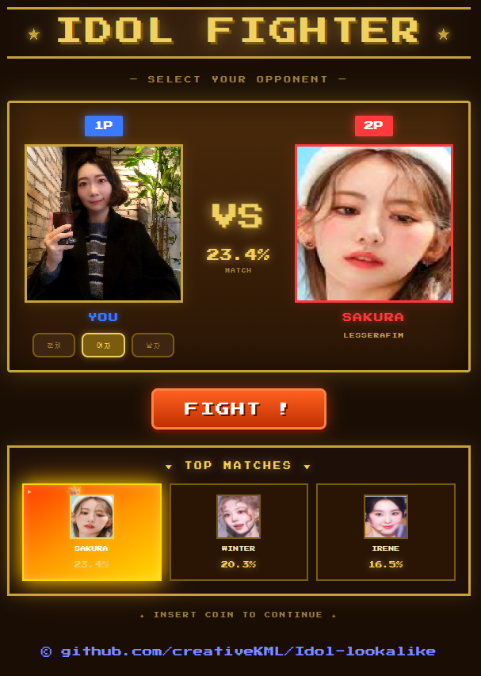

# 🎤 연예인 닮은꼴 찾기 (Idol Face Lookalike) - v2

내 사진을 업로드하면 ArcFace 기반으로 가장 닮은 연예인 Top-3를 찾아주는 웹 서비스입니다.  
👉 v2에서는 UI/UX 및 인터랙션이 대폭 개선되었습니다.



---

## 🛠 기술 스택

| 구분 | 기술 |
|------|------|
| 얼굴 인식 | InsightFace (ArcFace) |
| 백엔드 | FastAPI + Uvicorn |
| 프론트엔드 | React + Vite |
| 임베딩 DB | pickle (코사인 유사도) |
| UI/UX | CSS Animation + Game UI |
| 사운드 | Web Audio API |

---

## ✨ v2 주요 개선 사항

- 🎮 레트로 게임 스타일 UI (IDOL FIGHTER 컨셉)
- 🆚 1P vs 2P 대결 구조 UI
- 🎧 효과음 추가 (선택 / 분석 / 에러)
- 🖱 드래그 앤 드롭 이미지 업로드
- 🏆 Top-3 결과 카드 UI 개선
- 👑 1등 결과 강조 (글로우 + 왕관)
- 🎯 성별 필터 기능 (전체 / 여자 / 남자)
- ⚡ 매칭 정확도 개선 (threshold 튜닝)

---

## 📁 폴더 구조
```
idol-lookalike/
├── backend/
│ ├── crawler.py # 연예인 이미지 크롤러
│ ├── crop.py # 얼굴 감지 + crop
│ ├── build_db.py # 연예인 임베딩 DB 생성
│ ├── server.py # FastAPI 메인 서버
│ ├── embeddings.pkl # 생성된 임베딩 DB (git 제외)
│ └── requirements.txt # Python 의존성
├── frontend/
│ ├── src/
│ │ ├── App.jsx # 메인 UI (v2 게임 인터페이스)
│ │ ├── App.css # 스타일
│ │ └── main.jsx
│ ├── public/
│ │ └── sounds/ # 🔊 효과음 (v2 추가)
│ ├── package.json
│ └── vite.config.js
├── data/
│ ├── idol_faces/ # 연예인 원본 사진 (git 제외)
│ ├── idol_faces_cropped/ # crop된 얼굴 사진 (git 제외)
│ └── idol_faces_cropped_v2/ # v2 개선 데이터
└── README.md
```

---

## 🚀 실행 방법

### 1. 환경 설치

```bash
# Python 환경
cd backend
python -m venv venv
source venv/Scripts/activate
pip install -r requirements.txt
```

### 2. 이미지 크롤링

```bash
cd backend
python crawler.py
```
> `data/idol_faces/` 폴더에 연예인 사진 50장씩 수집

### 3. 얼굴 Crop

```bash
cd backend
python crop.py
```
> `data/idol_faces_cropped/` 폴더에 얼굴만 crop된 사진 저장

### 4. 임베딩 DB 생성 (최초 1회)

```bash
cd backend
python build_db.py
```
> crop된 사진을 읽어 `embeddings.pkl` 생성

### 5. 백엔드 서버 실행

```bash
cd backend
uvicorn server:app --reload --port 8000
```

### 6. 프론트엔드 실행

```bash
cd frontend
npm install
npm run dev
```


### 7. 접속

```
http://localhost:5173
```

---

## 📊 동작 원리

```
내 사진 업로드
    ↓
InsightFace로 얼굴 감지 + 정렬
    ↓
ArcFace로 512차원 임베딩 추출
    ↓
연예인 임베딩 DB와 코사인 유사도 비교
    ↓
Top-3 닮은꼴 + 유사도 % 반환
```

---

## 🌿 브랜치 전략
```
main                          # 최종 배포
└── dev                       # 통합 테스트
    ├── feature/crawling      # 연예인 이미지 크롤링
    ├── feature/crop          # 얼굴 Crop
    ├── feature/build-db      # 임베딩 DB 생성
    ├── feature/server        # FastAPI 서버
    ├── feature/frontend      # React UI
    ├── feature/integration   # 프론트-백 연동
    └── feature/ui-v2         # UI/UX 개선 (v2)
```

## 📋 Issues & 진행 현황

| Issue            | 브랜치                   | 상태   |
| ---------------- | --------------------- | ---- |
| #1 프로젝트 초기 세팅    | `main`                | ✅ 완료 |
| #2 연예인 이미지 크롤링   | `feature/crawling`    | ✅ 완료 |
| #3 얼굴 Crop       | `feature/crop`        | ✅ 완료 |
| #4 임베딩 DB 생성     | `feature/build-db`    | ✅ 완료 |
| #5 FastAPI 백엔드   | `feature/server`      | ✅ 완료 |
| #6 React 프론트엔드   | `feature/frontend`    | ✅ 완료 |
| #7 프론트-백 연동      | `feature/integration` | ✅ 완료 |
| #8 UI/UX 개선 (v2) | `feature/ui-v2`       | ✅ 완료 |
| #9 사운드 인터랙션 추가   | `feature/ui-v2`       | ✅ 완료 |
| #10 최종 테스트 & 배포  | `dev → main`          | ✅ 완료 |

## ⚠️ 주의사항

- `embeddings.pkl` 및 `data/` 폴더는 `.gitignore` 포함
- frontend/public/sounds 폴더 필수 (v2 기능)
- GPU 환경: `onnxruntime-gpu` 설치 권장
- Python 3.9 이상 권장
